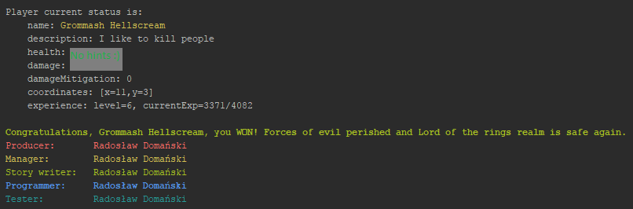

# Welcome to my simple RPG game

## Goal
The goal was to write a command line based role playing game.

This project is as a recruitment puzzle and requested stories/constraints are confidential

## General comments
* I didn't really have much to do this, so there are still many things to be improved, hence tons of TODOs in the code (for example loading/saving multiple saves)
* once the project gets evaluated I'll refactor this to be more developer-friendly (for example using Spring (DI, AOP), or JSON configuration files)
* test coverage is not nearly sufficient, but this is how it looks if you have only a couple of hours for a project :) (ps spock is awesome!)

## Running
### IDE
just run `main` method in `priv.rdo.rpg.Main` class

JAR
------------------
```
java -jar cli-rpg-1.0.0.jar
```

## Building

Project is based on Maven and can be built using the following command
```
mvn clean package
```

## PS
this game is not easy, but it can be defeated, if you try hard enough!

this is a proof!


